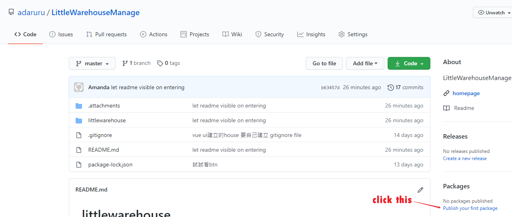
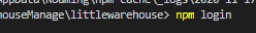

# littlewarehouse

## Project setup
```
npm install
```

### Compiles and hot-reloads for development
```
npm run serve
```

### Compiles and minifies for production
```
npm run build
```

### Lints and fixes files
```
npm run lint
```

### Customize configuration
See [Configuration Reference](https://cli.vuejs.org/config/).

### PowerShell無法使用cli

```
執行：get-ExecutionPolicy，如果顯示Restricted，表示狀態是禁止的
執行：set-ExecutionPolicy RemoteSigned
https://blog.csdn.net/lihefei_coder/article/details/100522281
```

### 簡單指令

vue ui 開啟UI介面的新增專案工具 (沒什麼用)

檔案下載

pdf  URL:  shorturl.at/uyBPQ
Long URL: https://whimsical.com/NCe1wwbTMAnLHGJXpwBfZs

- install VS code
- install npm

> npm -v
> npm install -g @vue/cli

### powershell 無法執行 

> set-ExecutionPolicy RemoteSigned
> https://blog.csdn.net/lihefei_coder/article/details/100522281

> vue create product-portal
> cd product-portal
> npm run serve


### 透過圖形使用者介面建立專案
> vue ui


### VS Code plugins
- Prettier - Code formatter
- Vetur
- Vue VSCode Snippets
- Trailing Spaces
- vscode-icons
- Todo Tree
- Bracket Pair Colorizer
- Prettier - Code formatter
- Settings Sync(推 保留套件設定)
- Auto Rename Tag
- Auto Complete TagAuto Complete Tag
- GitLens

### 使用elemet from 

- npm i element-ui -S
- 可是我以前學的好像是
  vue add element (import on demand zh-TW) 好像就是都可以

### App Vue


------

### nested 頁面處理

```html
<template>
  <div class="about">
    <h1>進入管理頁面</h1>

    <router-link to="/about/ShipManage">出貨</router-link> |
    <router-link to="/about/ProductManage">商品管理</router-link> |
    <router-link to="/about/AccountManage">帳號管理</router-link>
    <!--顯示的內容包在nested裡面-->
    <router-view class="nested-routes"> </router-view>
   
  </div>
</template>

<script>
export default {
 
};
</script>

<style></style>

```


### try follow github publish step



```
// Step 1: Use `publishConfig` option in your package.json
"publishConfig": { "registry": "https://npm.pkg.github.com/" }
// Step 2: Authenticate
// then input your github name and pw(generate via PAT)
$ npm login --registry=https://npm.pkg.github.com/

```
#### npm也要登陸




```
// Step 3: Publish
$ npm publish
```

